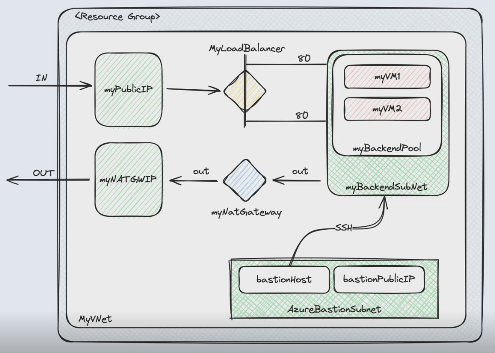

# terraform-academy

### project with architecture focused on learning, using Azure resources

## Install terraform
- [Terraform client](https://developer.hashicorp.com/terraform/install)

## Configure o Terraform with Azure Cloud Shell
- [Terraform in Azure Cloud Shell ](https://learn.microsoft.com/pt-pt/azure/developer/terraform/get-started-cloud-shell-bash?tabs=bash)


UML




## Build

#### start
- Add your azure access credentials to the 'providers.tf' folder

#### after build
```
terraform init
terraform plan -out main.tfplan
terraform apply "main.tfplan"
```

#### clear resourses
```
terraform plan -destroy -out main.destroy.tfplan
terraform apply "main.destroy.tfplan"
```
> repeat until all resources are deleted
